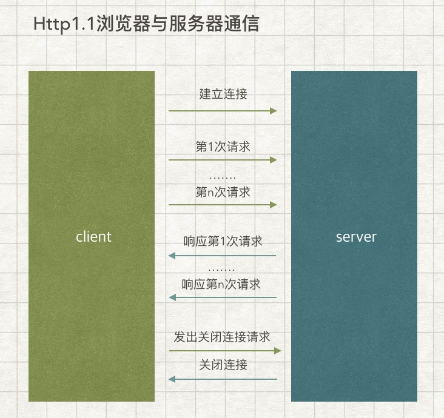

#Http持续链接机制
### Http1.0 版本
1. 客户端发起链接
2. 服务器响应，建立连接
3. 客户端发送请求
4. 客服器响应请求
5. 服务器关闭连接

该版本协议需要频繁建立连接，每个请求时相互独立，且建立单独的连接，如果在网页嵌入 css、图片、JavaScript、Applet等资源，会发起很多个连接，耗时严重，因为连接的建立是很耗时间的。

### Http1.1 版本

在1.0版本基础上增加一个持续连接的机制（persistent connections），通过这种连接，主要由以下作用：

1. 客户端发送请求接得到响应后，可以继续发送请求。

2. 客户端还可以发送流水线请求，也就是说，客户端可以连续发送多个请求，而不必阻塞于等待响应。

通信过程如下：

从上图可以看到，多个请求都是在同一个连接上面请求的。

## Http 请求
### 请求行
Method + URI + HttpVersion + CRLF
如：Get /test.html Http/1.1 (CRLF)，CRLF 表示换行
### 消息报头
### 请求正文

## Http 响应
### 状态行
HttpVersion + Status-Code + Reason-Phrase + CRLF
如：Http/1.1 200 OK (CRLF)

# VPN Tunnel Protocol
点对点，用来拨号上网的协议，完成用户认证，分配电脑/modem IP 地址都是由 PPP 协议完成。

传统的拨号上网过程，就是在 PPP client 和 PPP server之间完成PPP会话，认证用户，分配IP地址。如下图：

由于管理不灵活，后面就把 PPP server 部署到 IP 网络上面，如下图：

由于将 PPP server 部署到 IP 网络上面，所以需要我们建立一个 tunnel 来实现 PPP 协议的传输。而`PPTP` 和 `L2TP` 这两种协议（隧道协议）就是用来封装 PPP 协议，穿越IP网络/ATM云/MPLS云，到达 PPP Server，完成 PPP 会话。

## PPTP
由微软设计，简单来说就是对 PPP 协议的封装，只支持 IP 网络，单隧道，由于没有对 tunnel 做任何加密，所以其本身是不安全的。

## L2TP
由思科设计，基于 PPTP 之上拓展，支持网络多样性，多岁到，其本身也是不提供加密，需要借助 IP Security 来对 L2TP tunnel 加密，因此安全性较高。

