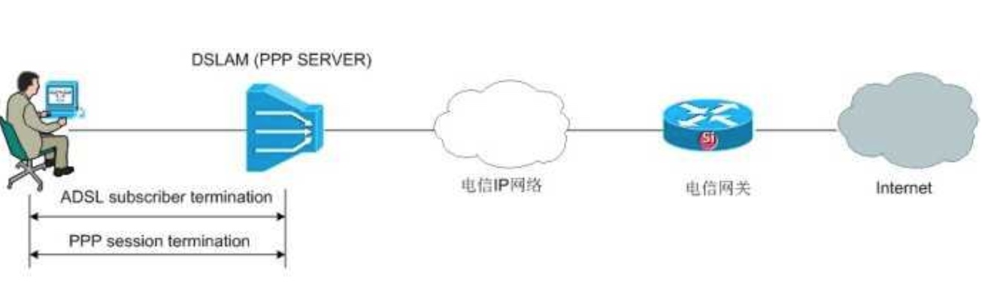
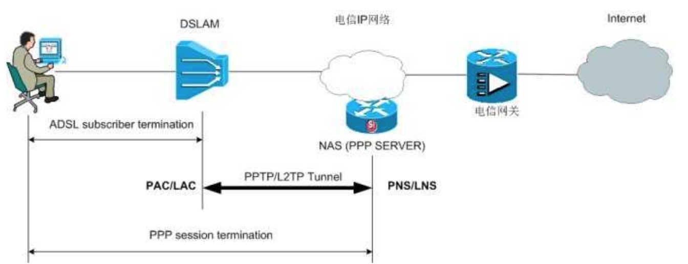

# VPN Tunnel Protocol
点对点，用来拨号上网的协议，完成用户认证，分配电脑/modem IP 地址都是由 PPP 协议完成。

传统的拨号上网过程，就是在 PPP client 和 PPP server之间完成PPP会话，认证用户，分配IP地址。如下图：

由于管理不灵活，后面就把 PPP server 部署到 IP 网络上面，如下图：

由于将 PPP server 部署到 IP 网络上面，所以需要我们建立一个 tunnel 来实现 PPP 协议的传输。而`PPTP` 和 `L2TP` 这两种协议（隧道协议）就是用来封装 PPP 协议，穿越IP网络/ATM云/MPLS云，到达 PPP Server，完成 PPP 会话。

## PPTP
由微软设计，简单来说就是对 PPP 协议的封装，只支持 IP 网络，单隧道，由于没有对 tunnel 做任何加密，所以其本身是不安全的。

## L2TP
由思科设计，基于 PPTP 之上拓展，支持网络多样性，多岁到，其本身也是不提供加密，需要借助 IP Security 来对 L2TP tunnel 加密，因此安全性较高。

