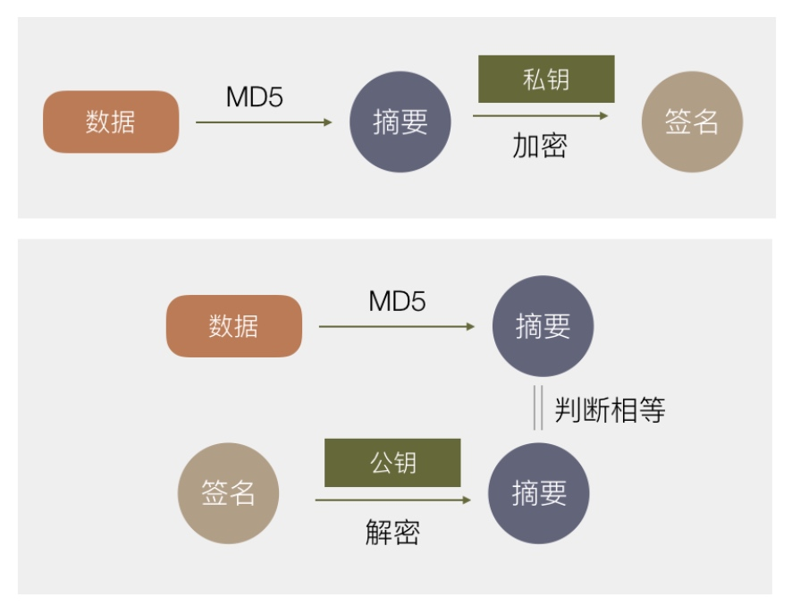

# iOS 签名
原因：保证每一个安装到 iOS 或 Mac 上的 App 都是经过苹果官方允许的。
签名一般指数字签名，基于非对称加密。（因数分解、欧姆定理）。其作用就是对某一份数据做标志，表示认可这份数据。发给其他人后，其他人可以知道这份数据是经过我认证，数据没被`篡改`过。基于非对称加密，其实现主要如下图所示：

> 非对称加密：公钥加密私钥解密或者私钥加密，公钥解密。（加密数据不能太大，）
> 对称加密：同一份钥匙加密解密

经测试，OSX 10.12.0 + 的系统，钥匙串设置成`允许任何应用访问` 或者 `部分应用访问` 均不会起作用，访问证书的私钥的时候还是会弹出授权框。因此在实现 iOS 自动化打包的时候，我们采取一下方式：

1. 先在新系统下 build 并且不要 codesign 项目，拿到未签名的 app。
2. 在 OSX 11.11.6 的系统上给 app 签名
3. 对已经签名的 app 直接转化成 ipa 包。

