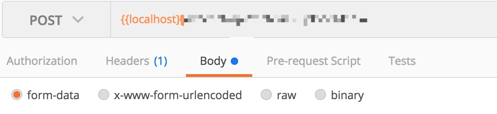

# postman 请求参数和 Spring Boot Controller 接受参数

我们经常使用 postman 来做接口校验，在 postman 中，post 请求分为以下几种类型：


这里简单讲解几种 content-type 类型的区别：

### form-data：
表单上传，当表单中包含文件时可以使用该类型。

前端如果使用 axios 作为请求框架的话，需要发送 FormData 对象。代码如下所示：

```js
let params = new FormData();
params.append("publicCode",this.publicCode);
params.append("kfAccount", this.kefuFormValidate.inputAccount);
params.append("nickName", this.kefuFormValidate.inputNickname);
params.append("inviteWx", this.kefuFormValidate.inputWechart);
params.append("headImg", this.headFile);
this.axios.post("/weixin/kefu/add", params).then(res => {
...
})
```

### x-www-form-urlencoded：
跟 form-data 类似，区别在于不能上传文件。

### raw
文本格式，一般我们会设置其 content-type 为 application/json。

> 这里需要注意的是，前面两种 content-type 类型在 spring 中都能用 HttpServletRequest 获取，而 application/json 类型的数据是保存在 HttpEntity 中，所以在 spring 中不能用 HttpServletRequest 获取。

一般在后台项目中，我们会实时打印出用户请求的参数，方法等信息。通常做法是用 AOP 拦截请求后打印出来。
我在实践的时候就遇到一个问题：

打印的参数应该从 JoinPoint 的对象获取，而不是从 HttpServletRequest 获取，因为 application/json 格式的数据不会保存到 HttpServletRequest 中。

> 由于业务需求，我每条接口都需要传递一个 checkCode 字段，但由于Controller 中形参的 bean 是使用第三方，所以我这边不好改，因此我这边有以下2种解决方法：
  
1. 自定义 bean 继承第三方的 bean，添加 checkCode 属性
2. 由于 spring 使用 HttpMessageConverter 来帮我们转化请求响应数据，因此可以实现该接口来修改我们的参数，相较于第一种会麻烦点。


