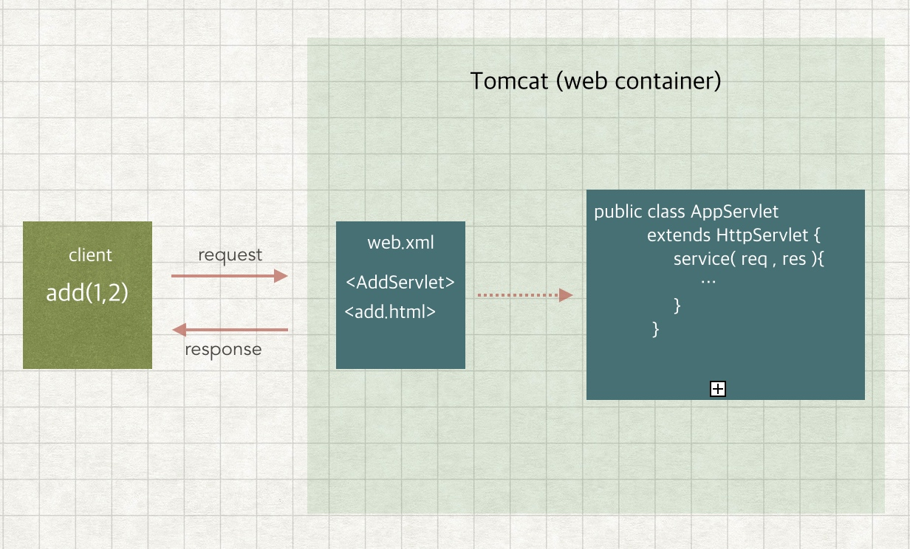

# HttpServlet 源码解析

servlet 是用 java 编写的服务端程序，主要用于处理请求和返回响应内容。通常在 web 容器中起作用。

这里我们提出几个问题：
- 使用 servlet 编写 web 端应用时，为什么只继承 HttpServlet 类，且必须覆写其中的一个方法？
- HttpServeltRequest 和 HttpServletResponse 里面是什么内容，还有 doGet 和 doPost 方法里面是什么？

Servlet 作用大致如下：

