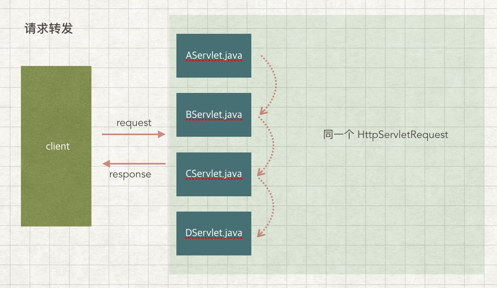
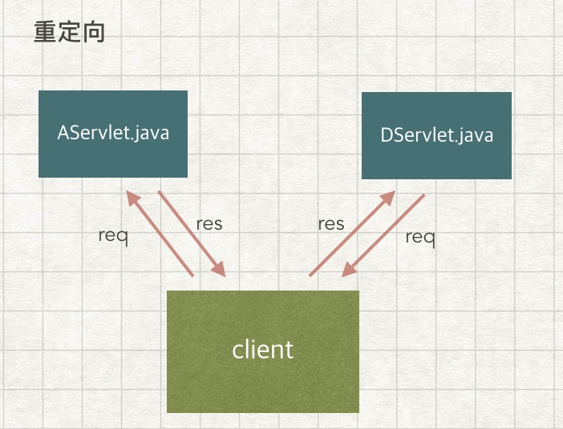

# 请求转发和重定向及其应用场景

### 请求转发
客户端发出请求后，经过多个 Servlet 进行处理，最后返回响应数据。这个过程中，每个 Servlet 处理的都是同一个的 HttpServletRequest 。即后面的 Servlet 能够获取前面 Servlet 的 attribute 。

如下图：

请求转发到下个 Servlet 是调用 HttpServletRequest 的 requestDispatch() 方法，获取 requestDispatch 对象后调用forward() 方法。

### 重定向

客户端发出请求后，服务器端会返回响应，并且让客户端再发送一个请求。因此实际上重定向会让客户端发送两个请求。

重定向是通过调用 HttpServletResponse 对象的 sendRedirect() 方法。

### 两者区别
- 地址栏：请求转发后，地址栏的 URI 就是第一次请求的 servlet 名字，跟显示的页面可能没有任何关系。而重定向，地址栏的 URI 就是显示的页面。
- 请求次数：请求转发只有一个请求。重定向会有两个请求，且第一个请求的 status-code 为304。

