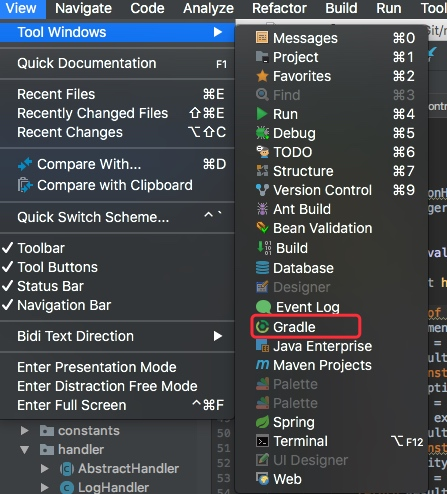

# maven 项目转化成 gradle 项目实践
由于之前项目使用了 mybatis 的自动生成代码插件（只支持 maven），所以一直使用 maven 构建项目，后面因为某些原因改用 gradle 构建项目。这里记录下如何在 idea 下将 maven 项目转成 gradle

> idea 版本 ：IntelliJ IDEA 2017.3 (Ultimate Edition)
> maven 版本：3.2.5
> gradle 版本：4.3.1

在项目根目录输入命令：
```
    gradle init --type pom
```
转化后的项目目录就有 build.gradle、setting.gradle 等 gradle 项目的配置。还保留了 pom 文件。

这时候会发现 IDEA 窗口右边并没有 gradle 构建的图标：


因为 IDEA 的项目都会在项目根目录生成 .idea 来记录项目的信息，解决方法如下：

- 删除无用的 pom 文件
- 重新关闭项目
- 打开 IDEA 后，导入项目，选择 gradle 项目（如果没有该过程，可以直接删除 .idea 文件后再导入项目）
- 导入  gradle 项目的时候会选择 gradle 的相关配置，填写完毕即可。
- 项目打开后，选择如下即可：

 


