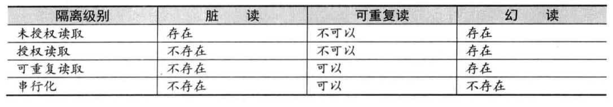

# 小白入门 ZooKeeper
直接上来就讲 ZooKeeper 是分布式服务框架，可能很多跟我一样的小白都会一脸懵逼。在讲 ZooKeeper 是什么之前，先了解下分布式的开源。

### 问题引入
#### 集中式系统

集中式系统的特点非常明显，所有数据和业务都部署于一台主机上。部署结构简单，但缺点也很明显，一旦个中服务有问题，修改后就得重新部署整个项目。维护起来相当不便。随着网络的普及，用户访问量的迅速提高，业务地频繁更改，分布式系统逐渐流行。

#### 分布式系统

这里引用《分布式系统概念与设计》一书的回答：
> 分布式系统是一个硬件或软件组件分布在不同的网络计算机上，彼此之间仅仅通过消息传递进行通信和协调的系统。

一般分布式系统会有以下几个特征：

- 分布性：时间空间随机，任意一台服务器。
- 对等性：分布式系统中各个节点没有主从之分，服务互相调用。
- 并发性：多个节点可能同时请求某个资源（类似并行）。
- 缺乏全局时钟：多个节点间通过交互消息来进行相互通信，所以很难定义事件的前后顺序。

#### 分布式系统中的典型问题

传统的单机系统，所有服务都在同一台计算机上，服务间通过内存访问，而在分布式系统上，由于服务存在于不同的计算机节点上，所以在互相调用的时候只能通过网络通信（rpc协议）的方式。因此经常会出现以下几个问题：

- 通信异常：由于引入了网络通信，所以增加了很多不可靠性，网络光纤、路由器或是 DNS 等第三方因素都有可能影响服务间的通信，造成网络延迟。
- 网络分区：当网络延迟越来越严重的时候，可能会导致部分节点不可用，部分节点能正常通信。出现局部小集群，而这些小集群得完成原本需要整个分布式系统完成的功能，包括对分布式事务的处理，这就对分布式一致性提出非常大的挑战。
- 三态：通过第一点可知道，由于加入网络因素，所以会出现`超时`状态。此时网络通信的发起方是无法确定请求是否被成功处理。
- 节点故障：服务器节点出现宕机等异常现象。

总结来说，想要解决分布式系统的问题，就是解决下面几个问题：

1. 分布式系统中事务如何处理？

2. 分布式系统中数据的一致性？

3. 分布式系统中各个节点间如何通信？

#### 事务的回顾
了解分布式系统事务前，先了解下事务的内容

事务是指一系列对系统数据的操作所组成的一个程序执行逻辑单元。这里我们把多个 CURD 的操作都抽象成一个事务概念。事务一般有以下几个特性，也成为 ACID：

- 原子性：事务的执行只有全部成功和或者全部不执行。任何一项操作失败都会导致整个事务失败，并撤销回滚。

- 一致性：该性质主要针对数据库的状态来描述，指事务执行后，数据库的状态应该与执行前状态保持一直，即执行前数据库状态是正常的，那执行后也应该正常。

- 持久性：事务执行并提交后，会永久保存到数据库里面。

- 隔离性：该性质主要出现在并发情况下，多个事务间是相互隔离的。一个事务的执行不会影响到其他事务。

    在标准 SQL 的规范中，定义了事务的四个隔离级别。不同的隔离级别对事务的处理不同。
    
    1. 未授权读取：
         
        事务 A 和事务 B 同时进行，事务 A 会将数据1做一系列加法直到10才提交，事务 B 能够看到这个操作过程中数据的所有变化，即能够读取到1，2，3...
            
    2. 授权读取

        还是上面那个操作，不过事务 B 只能在事务 A 提交后才能读取到数据，即只能读取到10。
        
    3. 可重复读取

        事务 A 先读取数值得到1，然后进行一系列加法加到9，此时事务 B 修改数值为 4 并提交，事务 A 重新读取数值，还是会得到 9。（体现隔离性）

    4. 串行化

        不能并发执行事务，事务 B 只能等事务 A 执行完提交后才能执行。
        
由于隔离级别的不同，一般会出现以下几个问题：

- 脏读：未授权读取中，事务 B 读取到事务 A 未提交的数据，称为脏数据。

- 不可重复读：授权读取中，假设事务 A 在执行加法操作到9的时候，事务 B 对赋值数据为5并提交，此时事务 A 读取到的数据就是5，而不是9。更直观的描述可以参考下图：
  

- 幻读：该现象引用在网上看到的回答如下:
 
 
 以上四个隔离级别在性能上逐渐下降，但在隔离级别上逐渐增强。下表对这四个隔离级别进行一个简单的对比：
 

回到主题，在单机数据库中，我们能够很容易实现一套 ACID 特性的事务处理系统。但在分布式系统中，由于事务的参与者，支持事务的服务器，资源服务器，事务管理器等分别位于分布式系统的不同节点上，所以要实现能够保证 ACID 特性就格外复杂，

由此引入 `CAP` 和 `BASE` 理论。

。。。。

#### 初识 ZooKeeper 
了解分布式系统中处理数据一致性的复杂后，接下来就可以引入 ZooKeeper 了。

Zookeeper 由雅虎创建，是 Google Chubby 的开源实现。是一个风不是协调服务框架。其设计目标是将那些复杂且容易出错的分布式一致性服务封装起来。并以一系列简单易用的借口提供给用户使用。

根据 Zookeeper 的一些特性，分布式应用可以基于它实现诸如数据发布-订阅、负载均衡、命名服务、集群管理、master 选举、分布式锁和分布式队列等功能。

xian

