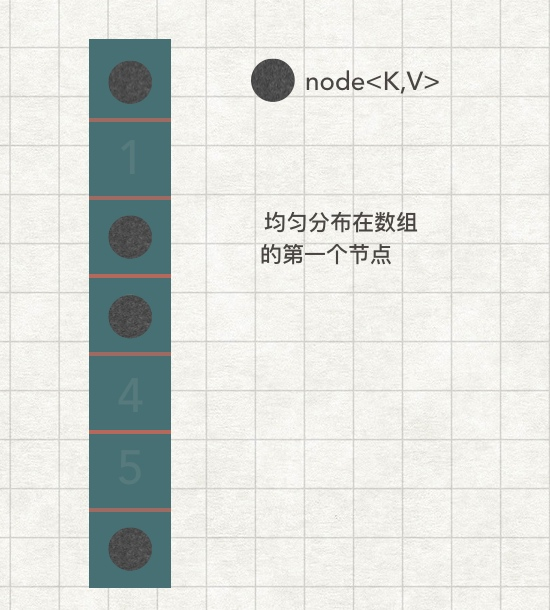

# HashMap 
这里先抛出我对 HashMap 理解的一些特性，后面再从这些特性来深入了解。

1. 结构为数组 + 链表，默认长度为16（1 << 4），负载因子为0.75。允许初始化修改长度和负载因子，不过一般不建议修改负载因子。
2. 继承 AbstractMap 类，实现 Map 接口,链表节点也实现 Map 接口。
3. key、value 允许 null 值，存储无序，线程不安全，当链表节点大于等于7时链表变成红黑树。
4. 数组的下标为 ( h = key.hashCode( ) ) ^ ( h >>> 16 )) & ( n-1 )，当发生哈希冲突时，就存放到链表节点的 next 上。
5. 查找速度最快可为O(1) ，最慢则为O(n)和O(lgn)。
6. 当数组的存放节点数 > 数组长度 * 负载因子时，数组扩容2倍 (1 << 2)。

<!-- more -->

现在我们一一来回答上面的问题。
#### 负载因子
 采用数组 + 链表的结构是为了方便结合 hash 的特定快速存取数据。负载因子0.75是通过大量数据测试得出来的结果，是对空间和时间效率的平衡。为什么需要负载因子，这是个好问题。

#### 计算数组下标

hashmap 利用了数组的特性，能够实现快速索引，结合 hashcode 的特性，能够实现存取的时候快速获取数组下标，在最优情况上的时间复杂度为 O(n)，如下图：



想要达到上面的理想效果，需要负载因子、数组长度、好的 hashcode 算法来实现。这里我们看下hashmap 如何实现 hashcode 来尽量减少 hash 冲突。
查看 Hashmap 源码的 put 方法如下：

```
public V put(K key, V value) {
    // 这里我们主要看 hash 方法
    return putVal(hash(key), key, value, false, true);
}

static final int hash(Object key) {
   int h;
   return (key == null) ? 0 : (h = key.hashCode()) ^ (h >>> 16);
}

final V putVal(int hash, K key, V value, boolean onlyIfAbsent, boolean evict) {
   Node<K,V>[] tab; Node<K,V> p; int n, i;
   ...
   if ((p = tab[i = (n - 1) & hash]) == null)
   ...
}
```
代码中我们可以看到最后获取的下标需要经过两步运算：

1. ( h = key.hashCode( ) ) ^ ( h >>> 16 )
2. ( n - 1) & h 
        
这里我们参考的是 JDK8 的源码，也是对比 JDK7 的优化的地方。下面是这两步运算的作用:
从简单的说起，由于 n 的长度就是数组的长度，永远都是2的倍数，二进制表示如下：

| 数值 | 二进制 | n-1的二进制 |
| :-: | :-: | :-: |
| 2 | 10 | 01 |
| 4 | 100 | 011 |
| 8 | 1000 | 0111 |
| 16 | 1000 | 01111 |

根据上表可以发现 n-1 的二进制其实就是掩码，这时候如果跟任意数做与运算，得到的结果其实相当于取模运算，这样不仅能达到下标不越界的目的，还极大的提高了运行效率，因为 & 运算比 % 取模运算效率要高。

假设 h 为任意哈希值的二进制为 `101010100101001001101`，当数组长度为4，8，16时其结果如下所示

```
011   & 101010100101001001101 = 01    下标=1，数组长度=4
0111  & 101010100101001001101 = 101   下标=5，数组长度=8
01111 & 101010100101001001101 = 1101  下标=13，数组长度=16
```

不过上面的运算也暴露了一个问题，就是 `101010100101001001101` 的高位是没有进行`与运算`的。在源码中有特殊说明：


大致意思是 hash 值的高位，没有参与数组下标计算，而是被掩码给掩盖掉了。假如 Float 类型的 hash，特点是低位都是 0，高位才有变化，例如：

```
System.out.println(Integer.toBinaryString(new Float(1).hashCode()));
System.out.println(Integer.toBinaryString(new Float(2).hashCode()));
System.out.println(Integer.toBinaryString(new Float(3).hashCode()));

// 运行结果：
// 111111100000000000000000000000
// 1000000000000000000000000000000
// 1000000010000000000000000000000
```

如果是用 float 类型 Key 的 hashCode &( n-1 )，就会出现严重的 hash 冲突。因此，为了避免这种特殊的情况，就需要高位也参与运算（即：`( h = key.hashCode( ) ) ^ ( h >>> 16 )`），该运算主要是将 Key 的 hashCode 的`低位与高位进行异或运算`。

#### 红黑树
虽然 JDK 8 已经优化了 hash 算法，尽量避免 hash 冲突，但是还是会遇到hash 冲突的情况，当 hash 冲突的时候，采用的解决方法就是将冲突的节点记录到对应数组下标节点所在的链表上。此时 get 节点的时间复杂度就变成O(1) + O(n)，为了提高 get 到节点的速度，JDK 8引入了红黑树进行优化，源码如下：

```
final V putVal(int hash, K key, V value, boolean onlyIfAbsent,
                   boolean evict) {
    ...
    for (int binCount = 0; ; ++binCount) {
         if ((e = p.next) == null) {
             p.next = newNode(hash, key, value, null);
             if (binCount >= TREEIFY_THRESHOLD - 1) // TREEIFY_THRESHOLD : 8
                 treeifyBin(tab, hash);
             break;
         }
         if (e.hash == hash &&
             ((k = e.key) == key || (key != null && key.equals(k))))
             break;
         p = e;
     }
    ...    
}
```
当链表节点个数大于等与7的时候，会将链表结构转化成红黑树结构，提高检索到节点的速度。

#### 数组扩容和 rehash
当数组中的节点个数大于负载因子限制的个数时，就需要进行数组扩容，这里依然以 put( ) 源码为例：

```
final V putVal(int hash, K key, V value, boolean onlyIfAbsent,  boolean evict) {
    ...
   if (++size > threshold) // threshold = 数组长度 * 负载因子
       resize();
    ...
}

final Node<K,V>[] resize() {
    ...
   if (oldCap > 0) {
   // 当旧数组长度 >= (2^30)
       if (oldCap >= MAXIMUM_CAPACITY) { 
       // 负载数组长度固定为 2^31 
           threshold = Integer.MAX_VALUE;
       // 数组不再扩容
           return oldTab;
       }
       // 扩容（DEFAULT_INITIAL_CAPACITY 为默认数组长度，1 << 4）
       else if ((newCap = oldCap << 1) < MAXIMUM_CAPACITY &&
                oldCap >= DEFAULT_INITIAL_CAPACITY)
           newThr = oldThr << 1; // double threshold
   }
    ...
```
从源码可以看到，扩容的时候是将长度左移1位，也就是 长度 * 2。

下面讲解下为什么要 << 1。

首先要知道，数组扩容后，需要对数组内的所有节点重新计算下标。JDK7 采用的是最简单粗暴的方法，即遍历每个数组的每个链表的节点，重新计算下标及链表位置（计算链表采用头插入法）。JDK8后对节点的重 hash 算法进行了改进，结果如下:

假设数组长度为8，根据之前的计算下标公式`(n-1) & hash`：

| n-1 | 0000 0000 0000 0000 0000 0000 0000 `0111` | (n-1) &hash(key) |
| --- | --- | --- |
| hashCode | 1111 1111 1111 0000 0000 1111 0000 `0101` | 0000 0000 0000 0000 0000 0000 0000 `0101` |
| hashCode | 1111 1111 0000 0000 1010 1111 0001`0101` | 0000 0000 0000 0000 0000 0000 0000 `0101` |


假设数组长度扩容后为16：

| n-1 | 0000 0000 0000 0000 0000 0000 000`0 1111` | (n-1) &hash(key) |
| --- | --- | --- |
| hashCode | 1111 1111 1111 0000 0000 1111 000`0 0101` | 0000 0000 0000 0000 0000 0000 000`0 0101` |
| hashCode | 1111 1111 0000 1010 0000 1111 000`1 0101` | 0000 0000 0000 0000 0000 0000 000`1 0101` |

观察上面结果可以发现，扩容后，如果之前 hashCode 左移1位为0，则下标结果跟扩容前不变，如果左移1位为1，则下标也要左移1。

如图为扩容前数组长度为16，扩容后为32的下标重计算图，蓝色表示hashCode 左移1位值为0，绿色表示左移1位值为1：


JDK 8 采用这种方式 rehash 获取下标对比 JDK 7 有以下几个优点：

1. 提高 rehash 的效率
2. JDK 7 采用链表头插入，旧链表迁移新链表的时候，如果在新表的数组索引位置相同。则链表元素会倒置，而根据上图可以发现 JDK 8 不会。
3. 在 rehash 的时候， 之前的 hashCode << 1 位上是不确定为 0 或 1，是随机的，因此在一定程度上能够将节点均匀分散到数组上，提高索引速度。

#### 线程安全
这里我们从存取这两个角度来说明 HashMap 的线程不安全导致的后果。

- 存数据

    多线程调用 put 方法的时候导致数据不一致。
   
    比如有两个线程A和B，首先A希望插入一个key-value对到HashMap中，首先计算记录所要落到的桶的索引坐标，然后获取到该桶里面的链表头结点，此时线程A的时间片用完了，而此时线程B被调度得以执行，和线程A一样执行，只不过线程B成功将记录插到了桶里面，假设线程A插入的记录计算出来的桶索引和线程B要插入的记录计算出来的桶索引是一样的，那么当线程B成功插入之后，线程A再次被调度运行时，它依然持有过期的链表头但是它对此一无所知，以至于它认为它应该这样做，如此一来就覆盖了线程B插入的记录，这样线程B插入的记录就凭空消失了，造成了数据不一致的行为。
    
- 取数据

    扩容的时候 resize()，可能会引起链表的 next 值指向上一个节点，造成hua 环形链表，此时如果调用 get( ) 方法获取数据，就会造成死循环。 


#### 参考链接
- [Java 8系列之重新认识HashMap](https://tech.meituan.com/java-hashmap.html)

- [Java HashMap工作原理及实现](https://yikun.github.io/2015/04/01/Java-HashMap工作原理及实现/)

- [知乎上的回答](https://www.zhihu.com/question/62923854)

